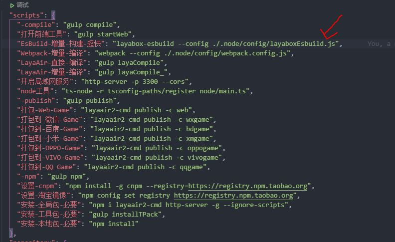
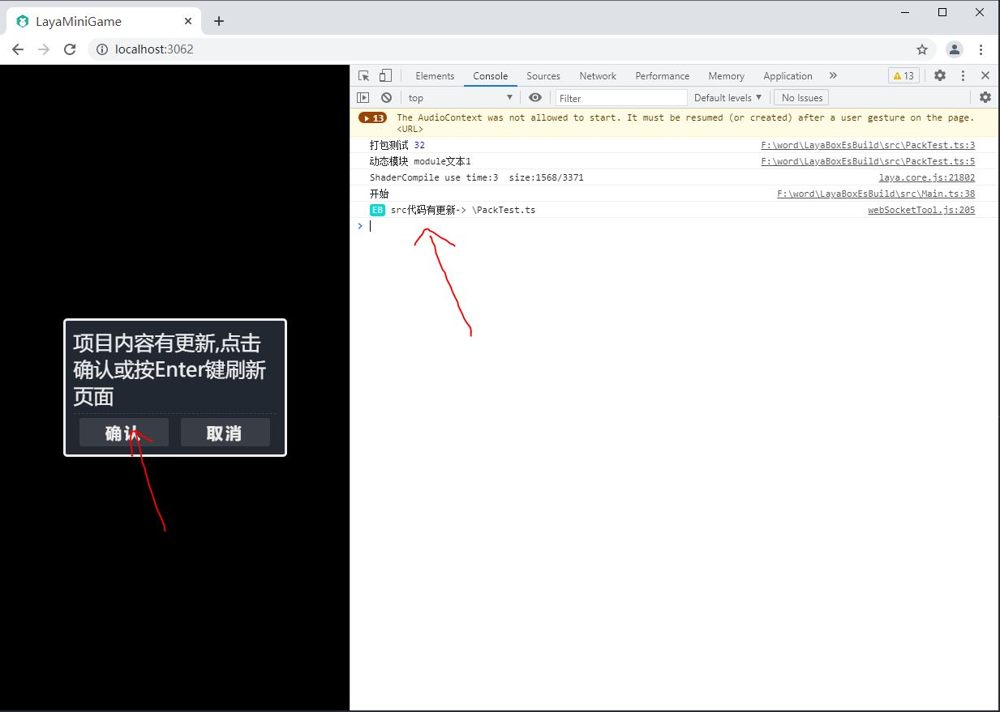

# LayaBoxEsBuild

##  介绍

- 使用 esbuild 来构建 layabox 项目 优化开发体验。

## 关于 esBuild
- <a href="https://github.com/evanw/esbuild/">gitHub</a>
- esbuild 是一个用 Go 语言编写的用于打包，压缩 Javascript 代码的工具库。它最突出的特点就是打包速度极快 （extremely fast），下图是 esbuild 跟 webpack, rollup, Parcel 等打包工具打包效率的一个 benchmark:

  

  图片取自 esbuild Github 仓库。
  
  #### 为什么它能做到那么快？

  有以下几个原因：

  它是用 Go 语言编写的，该语言可以编译为本地代码
  解析，生成最终打包文件和生成 source maps 的操作全部完全并行化
  无需昂贵的数据转换，只需很少的几步即可完成所有操作
  该库以提高编译速度为编写代码时的第一原则，并尽量避免不必要的内存分配
  更多详细介绍，详见 Breword 翻译的 esbuild 官方文档：https://www.breword.com/evanw-esbuild

## 对比其它工具

1. <font style="color: #00adb5;font-size:18px;font-weight: bold;">layaAir</font>：使用 rollup 工具构建，非常的慢，而且还要手动更新，不支持断点调试。

2. <font style="color: #00adb5;font-size:18px;font-weight: bold;">layaair2-cmd</font>：跟第一步差不多，就是加了个自动编译，速度可能会快一点点，支持断点调试。

3. <font style="color: #00adb5;font-size:18px;font-weight: bold;">webpack</font>：webpack构建比layaAir的rollup快上不少，而且是自动的，非常全面，但是虽然快上不少，但是它的构建和layaAir使用的rollup都有一个共同点，都是把所有代码打包到一个文件中，所以随着项目变大，也会变卡的，支持断点调试。

4. <font style="color: #00adb5;font-size:18px;font-weight: bold;">本工具</font>：改完代码立即就能看到效果，因为是被动编译的所以不需要等，而且编译的内容都缓存到内存中的，所以访问非常快，另外还支持断点调试。

## 使用方法

1. 安装npm包

    `npm i layabox-esbuild`

2. 执行命令

    `layabox-esbuild -s`

    如果报错，比如说找不到这个命令的话就把下面的命令写到package.json文件中

    

    然后把鼠标放到 'EsBuild-增量-构建-超快' [名字随便取但是不能有空格] 这个字符串上面就会提示运行脚本，然后点一下就ok了，如果没有提示就在 终端执行 `npm run EsBuild-增量-构建-超快`也行。

3. 当看到下面的输出时就说明跑起来了
    
    

4. 添加配置文件
    - 现在是能跑起来了，但是这时是用的默认配置文件跑的，所以这里需要手动指定一个配置文件来运行。
    - 在项目根目录下创建一个 layaboxEsbuild.js 的文件，然后写入以下内容

        ```
            const path = require('path');
            //
            /** 配置数据 */
            module.exports = {
                //代理目录
                src: path.resolve(__dirname, './src/'),
                /** bin目录 */
                bin: path.resolve(__dirname, './bin/'),
            };
        ```
    - 然后指定配置文件执行 `layabox-esbuild -c ./layaboxEsbuild.js` 以后就都用这个命令开始项目

5. 然后在浏览器中打开这个地址就能看到项目了，因为是个空项目所以是黑屏的。

    

6. 当你修改了代码之后就可以直接去刷新浏览器看效果了，不能等什么编译。并且浏览器那边也会提示你你改动的东西。包括bin目录下的资源，并且可以通过按Enter键直接刷新浏览器或者取消不刷新。
   
   

7. 如果要调试代码的话也是支持断点调试的。

    

## 全部配置
```
{
    /** 代理文件夹目录 */
    src: string,

    /** bin目录 */
    bin: string,

    /** 文件路径修改 */
    filePathModify: {
        a: RegExp,
        b: string,
    }[];

    /** 代理端口 */
    port: {
        src: number,
        bin: number,
    },

    /** 入口文件名，地址相对于src目录 */
    mainTs: string,

    /** 主页地址， 相对于bin目录 */
    homePage: string,

    /** 主页脚本， 相对于bin目录 */
    homeJs: string,

    /** 入口js文件，相对于bin目录 */
    mainJs: string,

    /** 是否打印日志 */
    ifLog: boolean,

    /** 是否启用webSocket工具 */
    ifOpenWebSocketTool: boolean,
}
```

## 其他

- esbuild不依赖任何跟laya相关的东西，它只是代理了src和bin这两个目录并按需编译src目录下的代码文件而已，对laya的任何升降级操作都不会对它造成任何影响，这里的laya项目只是个示例而已。

- 这个工具只是构建项目，不会把src的代码打包到bin/js/bundle.js文件里面而是缓存在内存中的，所以只能在开发环境中使用，最后在用laya的编译和打包，把代码都打包到bin/js/bundle.js文件中，它的作用就是优化开发体验，能更快的响应代码改动，不影响最终laya编译的结果。

- 最好把webpack的增量编译一起打开，因为esbuild只是构建不编译，所以在补个webpack的增量编译就完美了。