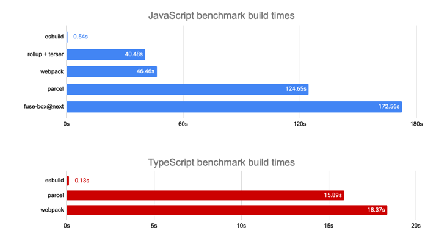
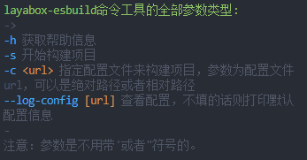
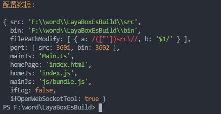
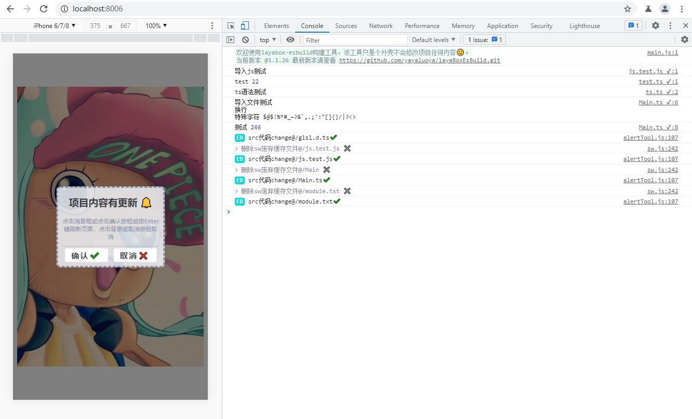

# LayaBoxEsBuild
[![NPM version][npm-image]][npm-url]

[npm-image]: https://img.shields.io/npm/v/layabox-esbuild
[npm-url]: https://npmjs.org/package/layabox-esbuild
##  介绍

- #### 使用 esbuild 来增量构建 layabox 项目 修改代码后立即就能看到效果 提高开发速度，优化开发体验。
- #### 视频介绍：https://www.bilibili.com/video/BV16w411R7ZT?share_source=copy_web
- 有问题加qq群 


----------

## 关于 esBuild
- <a href="https://github.com/evanw/esbuild/">esbuild</a> 是一个用 Go 语言编写的用于打包，压缩 Javascript 代码的工具库。它最突出的特点就是速度极快，下图是 esbuild 跟 webpack, rollup, Parcel 等打包工具打包效率的一个比较:

  
  图片取自 <a href="https://github.com/evanw/esbuild/">esbuild Github 仓库</a>。
  
  为什么它能做到那么快？
  
    它是用 Go 语言编写的。
    该语言可以编译为本地代码解析，生成最终打包文件和生成 source maps 的操作全部完全并行化，无需昂贵的数据转换，只需很少的几步即可完成所有操作。
    该库以提高编译速度为编写代码时的第一原则，并尽量避免不必要的内存分配。
    更多详细介绍，详见 Breword 翻译的 <a href="https://www.breword.com/evanw-esbuild">esbuild 官方文档</a>;

## 对比其它工具

| 工具类型     |                       简介                       | 修改代码后需要等多久才能刷新浏览器并看到修改后的效果 | 是否支持断点调试 |   推荐度   |
| :----------- | :----------------------------------------------: | :--------------------------------------------------: | :--------------: | :--------: |
| layaAir      |                   手动点击编译                   |                      一年，很慢                      |      不支持      | 强烈不推荐 |
| layaair2-cmd |        跟第一步差不多，就是加了个自动编译        |                       半年，慢                       |       支持       |   不推荐   |
| webpack      | 自动编译，功能强大，但是项目比较大的话还是会很慢 |                      一天，稍快                      |       支持       |    推荐    |
| **本工具**   |        自动构建，不编译，项目再大都没影响        |  0秒，飞快，切换到浏览器刷新的速度有多快它就有多快   |       支持       |  强烈推荐  |

## 安装

- npm安装。

    `npm i layabox-esbuild -g` 注意是全局安装，安装一次就行了。

## 命令

  

- `layabox-esbuild -i`

  - 在执行目录下初始化配置文件，内容是默认的配置内容。

- `layabox-esbuild -s` || `layabox-esbuild`

    - 直接开始构建项目，当看到如下输出时就说明跑起来了，局域网主页不固定，这里只是实例，本地主页更快的原因是使用 service worker 在浏览器和服务器之间加了一层缓存，所以建议开发时用这个地址。

        

- `layabox-esbuild -c <url>`
    - 指定配置文件来构建项目，不推荐使用，建议使用 `-i` 选项在当前目录下生成一个配置文件然后在这个配置文件的基础上进行配置。
    - 在项目根目录下创建 layaboxEsbuildConfig.js [位置，名字都可以随便，执行命令时参数填对就行了] 文件，然后导出一个满足IConfig接口的对象就行了，默认配置示例如下：

        ``` javascript
        /** 配置数据 */
        module.exports = {
            /** 代理src目录，可以是绝对路径或者相对路径 */
            src: './src/',
            /** 代理bin目录，可以是绝对路径或者相对路径 */
            bin: './bin/',
        };
        ```
    - 然后执行 `layabox-esbuild -c ./layaboxEsbuildConfig.js` 就可以以指定配置文件来构建项目了。
  
- `layabox-esbuild --log-config [url]`
    - 查看配置文件，如果不带后面的url参数则会打印默认的配置数据。示例：

        

- `layabox-esbuild -vl`
    - 查看所以历史版本。

- layabox-esbuild 还有快捷指令为 `leb` 把上面的命令中的 `layabox-esbuid` 替换掉即可。

## 全部配置选项

``` javascript
/**
 * 配置表接口
 */
export default interface IConfig {
    /** 代理src目录，可以是绝对路径或者相对路径 */
    src?: string,
    /** 代理bin目录，可以是绝对路径或者相对路径 */
    bin?: string,
    /** 文件路径修改，会把 a 匹配的替换成 b */
    filePathModify?: {
        a: RegExp,
        b: string,
    }[];
    /** 代理端口，可以随便指定，为0则自动分配，只要不冲突就行 */
    port?: {
        src: number,
        bin: number,
    },
    /** 主机地址，当有任何原因没有自动获取到主机地址时将采用这个地址 */
    hostName?: string,
    /** src目录文件默认后缀，当导入的文件不带后缀时会以这个数组依次寻找，知道找到匹配的，全部找不到的话就报错  */
    srcFileDefaultSuffixs?: string[],
    /** 入口文件名，地址相对于src目录 */
    mainTs?: string,
    /** 主页地址， 相对于bin目录 */
    homePage?: string,
    /** 主页脚本， 相对于bin目录 */
    homeJs?: string,
    /** 入口js文件，相对于bin目录 */
    mainJs?: string,
    /** 自动更新任务时间，分 */
    autoUpdateTaskTime?: number,
    /** 是否打印日志 */
    ifLog?: boolean,
    /** 断点类型 */
    breakpointType?: 'vscode' | 'browser',
    /** 是否启用webSocket工具 */
    ifOpenWebSocketTool?: boolean,
    /** 是否在启动时打开主页 */
    ifOpenHome?: boolean,
    /** 是否立即刷新浏览器 */
    ifUpdateNow?: boolean,
    /** 文件监听 */
    fileWatch?: {
        /** src目录的监听配置，enable选项无效 */
        src: IFileWatch,
        /** bin目录的监听配置 */
        bin: IFileWatch,
    },
    /** loader列表 */
    loader?: ILoaderConfig[],
     /** 
     * 文件读取后门
     * 系统读取不到目标文件时将会调用该方法
     * 使用该方法读取到的模块不会被缓存到内存中，故而不会有监听，如果有需要可以自行实现缓存和监听，然后调用_update方法更新页面就行了
     */
    fileReadBackDoor?: (_src: string, _update: (_url?: string) => void) => Promise<{
        /** 真实路径 */
        url?: string;
        /** 后缀 */
        su?: string;
        /** 异常 */
        err?: any;
        /** 数据 */
        data?: any;
    }>;
}

/**
 * 文件监听方式
 */
export interface IFileWatch {
    /** 是否启用 */
    enable: boolean;
    /** 是否使用轮询，使用轮询的话可能会导致cpu占用过高，不使用轮询的话可能会导致文件夹占用不能删除 */
    usePolling: boolean;
    /** 轮询间隔时间，usePolling=true有效 */
    interval: number;
}

/**
 * loader配置
 * 用于对匹配文件的额外处理，用来同步对应的打包系统保持，保持构建结果和打包结果的同步。
 * 默认的有path，txt两个loader用来处理ts文件的路径，和处理txt文件的导入。
 */
export interface ILoaderConfig {
    /** loader名字，打包出错时会给出提示 */
    name: string;
    /** 包含内容 */
    include: RegExp;
    /** loader */
    loader: (string | ILoaderHandleFunction)[];
}

/**
 * loader处理函数
 */
export interface ILoaderHandleFunction {
    (_content: string, _absolutePath: string, _suffix: string): Promise<string>;
}
```

## 注意

- 最重要的事。
  - 本工具不会修改项目的任何内容，相对于只是一个更快的快捷方式而已。

- esbuild只是构建项目，不会把src的代码打包到bin/js/bundle.js文件里面而是缓存在内存中的，所以只能在开发环境中使用，最后再用laya的编译和打包，把代码都打包到bin/js/bundle.js文件中，它的作用只能体现再开发时，能更快的响应代码改动，不会影响最终laya编译的结果。

- 最好的方案是把webpack的增量编译一起打开，因为esbuild只是构建不编译，所以在补个webpack的增量编译就完美了，如果电脑卡的话就算了，最后上传代码时别忘了用laya或者webpack编译一下就行，不然bin/js/bundle.js是不会被更改的。

- 本工具由于加入了多方面的缓存所以访问会很快，但这也是容易产生bug的地方，所以当出现代码没及时更新的情况，请重启工具和浏览器【目前在测试中还没有发现这方面的问题】。

#### 最后奉上项目测试页面截图



当项目内容有更新时就会出现一个弹出提示项目有更新点击相关按钮就可以更新页面，当从编辑器切换到浏览器时如果触发了浏览器的获取焦点事件就能自动更新，是不是很方便呢。